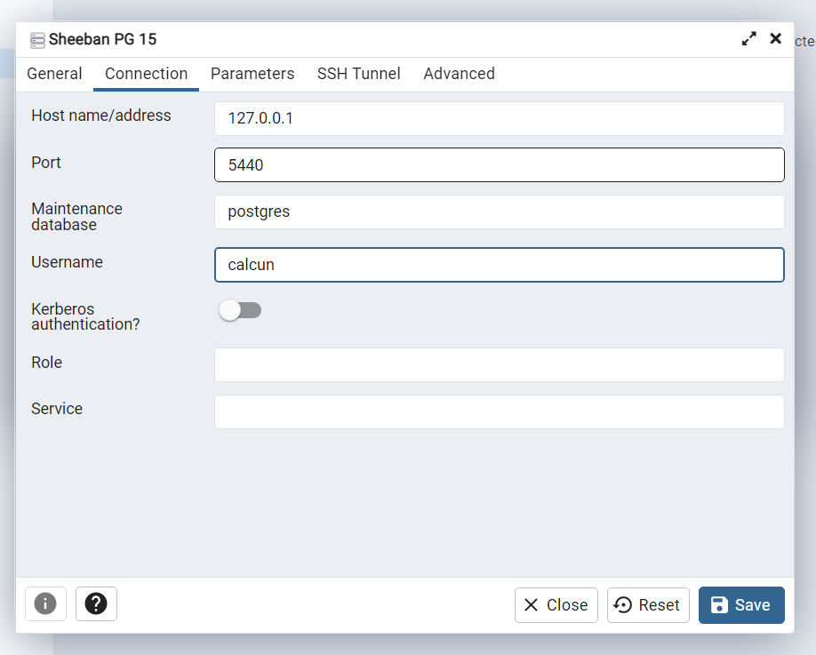

# PostGis Backend Container 

## Setup:

**Windows User**
 - Please execute setup.bat it will start the docker container.

**Linux User**
 - Please execute setup.sh it will start the docker container.

**Note**: If you don't see the expected results please execute clean.bat (Windows) or clean.sh (Linux) and then run the setup.bat or setup.sh for windows or linux OS respectively.

### Web Address

 - Now open browser and navigate to http://localhost:8080.

- To view as admin view go to: http://localhost:8080/admin
    - username: admin
    - password: admin

### Clean:

- To remove the container with volumes, just run clean.bat or clean.sh depending on if you are using window or linux OS. It will spin up all docker containers for you.

NOTE: This remove all the data from tables and those tables which were created previously so be aware of that.

## Web App Features/Tabs Details

### Data Upload Tab

 - Data Upload Tab is the part of the localhost:8080
 - The data upload tab has the functionality to upload various file formats from the web to the PostGIS DB.
 - Please specify the table name and the data would be ingested in the database. No overwrites only new tables.
 - You can see the GeoJSON, Shapefile, KML, KG under calcun_data database within the table_name that was mentioned
 - Low size zip files are supported over the network. All these points are part of web upload.

#### File Types Supported for Ingestion through Web
 - GeoJSON
 - Shapefile
 - KML
 - Knowledge Graph (JSON)

**Instructions to ingest data through web**
[Data Upload Tab](http://localhost:8080/upload)
 - Provide a new (non-existing) table name.
 - Select the file type
 - Upload the file 
 - Submit

## Data Ingestion - CLI

### How to execute ingestion script:

1. Create "ingestion_data" in root of the code folder. 
2. Copy your data inside this folder.
3. Now open cmd or bash anywhere and you can execute following command

#### Ingestion of the GIS data
The ingestion handles multiple file types such as:

 - Shapefile
 - Tiff
 - GeoJSON
 - Json
 - Zip folder of GIS data
```bash
docker exec -it calcun-webapp-geodjango-1 python vtp/ingest.py -i /ingestion_data/reprojected_new.zip -nln ata_ -overwrite
```
**Anatomy of the command:**

- The below part of the command includes docker specific commands and path to folder containing data to be ingested, it doesn't change after adding ingestion_data in the code folder.

```bash
docker exec -it calcun-webapp-geodjango-1 python vtp/ingest.py -i /ingestion_data/
``` 
- `reprojected_new.zip` - It is the name of file that needs to be ingested and must be present in ingestion_data folder. 
- `-nln` - New layer name is specific keyword , which would always remain constant.
- `ata_` --flag can be replace by whatever table name is required, if inside the zip file there is a file with name new.shp, then all its data would be ingested inside newly created table ata_new.

#### Ingestion of the Knowledge Graph - (JSON)

- For knowledge graph you need to make sure that json file is correct and also must specify the "kgn" parameter, which is name of the knowledge graph.

- In the following example command "TestCarto" is kg name.

```bash
docker exec -it calcun-webapp-geodjango-1 python vtp/ingest.py -i /ingestion_data/kg.json -nln zip_alb_ -overwrite -kgn TestCarto
```

**Anatomy of the command:**
- `kg.json` -- this is the name of KG file present in ingestion data folder.
- `-nln zip_alb_`  -- are specific keywords and always remain constant.
- `-kgn` -- knowledge graph name this keyword is read by the ingestion script to recognize that inserted data is of knowledge graph and this needs to be used in the command always.
- `TestCarto` -- this is the name of Schema that you want to be named wherein the ingested data would be populated

**OR**

#### Ingestion of the CSV in the AGE Tables

```bash
docker exec -it calcun-webapp-geodjango-1 python vtp/ingest.py -nf /ingestion_data/kg_nodes.csv -lf /ingestion_data/kg_links.csv -nln zip_alb_ -overwrite -kgn TestCarto
```
**Anatomy of the command**

- `docker exec -it calcun-webapp-geodjango-1 python vtp/ingest.py `--  The below part of the command includes docker specific commands and path to folder containing data to be ingested, it doesn't change after adding ingestion_data in the code folder.
- `-nf /ingestion_data/kg_nodes.csv -- nf` represents node file , ingestion_data is the folder created in code folder and kg_nodes.csv is the csv which contains nodes information of KG
- `-lf /ingestion_data/kg_links.csv -- lf` represents links file, ingestion_data is the folder created in code folder and kg_links.csv is the csv which contains links information of KG
- `-nln zip_alb_` -- are python specific keywords and always remain constant
- `-kgn` -- Knowledge Graph Name this keyword is read by the ingestion script to recognize that inserted data is of knowledge graph and this needs to be used in the command always
- `TestCarto` -- this is the name of Schema that you want to be named wherein the ingested data would be populated


- To import spatial data using csv
```bash
docker exec -it calcun-webapp-geodjango-1 python vtp/ingest.py -i /ingestion_data/testDataCSV.csv -dt  spatial_csv -nln test3 -overwrite
```

**Anatomy of the command**

- The below part of the command includes docker specific commands and path to folder containing data to be ingested, it doesn't change after adding ingestion_data in the code folder.

`docker exec -it calcun-webapp-geodjango-1 python vtp/ingest.py -i /ingestion_data/`

- `testDataCSV.csv` -- this is the csv file name present in ingestion data folder

- `dt  spatial_csv -nln` -- keywords to recognize the inserted data is part of spatial csv ingestion,and stays constant

- `test3` -- table name which needs to be created or existing table name where data needs to be concatenated

- Other factors to consider

1-If table is already existing, using overwrite flag we can overwrite existing values,if we do not use overwrite
  flag,values will be appended in the existing table.

2- While inserting the csv in table, the terminal will ask to insert data types of all the columns present in csv,
   make sure to enter all data types of every column accordingly, so the data types of existing columns match with
   new data.
   For example if the data type of any column is bigint , then we would select 2 to consider data type as bigint.
   Options would be mentioned on the screen.

3 - After selecting data types for columns, we would get the option to enter epsg code for geometry, enter the 
    code if it is anything other than 4326 , which is the default code.

4 - Finally, it will ask to enter the geometry type, just like data type, you need to enter 1,2 or 3 considering 
    geometry type is Point, Line or Polygon, options would be mentioned on the screen for this too.


- You can run following command to get help about different parameters of the script,
```bash
docker exec -it calcun-webapp-geodjango-1 python vtp/ingest.py --help
```


NOTE: Your docker path variable must be set, it is already set by default when you install docker. If not set so you just need to set that.

## Working with AGE extension:
https://github.com/apache/age#quick-start
https://www.fabiomarini.net/postgresql-with-apache-age-playing-more-seriously-with-graph-databases


## General instructions:

- To connect to postgresql in pgAdmin 4:
    - Install pgAdmin 4
    - Setup connection using following screenshot:

        
        <br />
        <br />
        
        <br />
        <b>Note:</b> <i>In above screenshot use <b>localhost</b> for <b>Host name/address</b> if <b>127.0.0.1</b> does not works for you.</i>
        <br />
        <br />
        
        <br />
    - For password please see it in <b>.env</b> file inside <b>db</b> folder.
